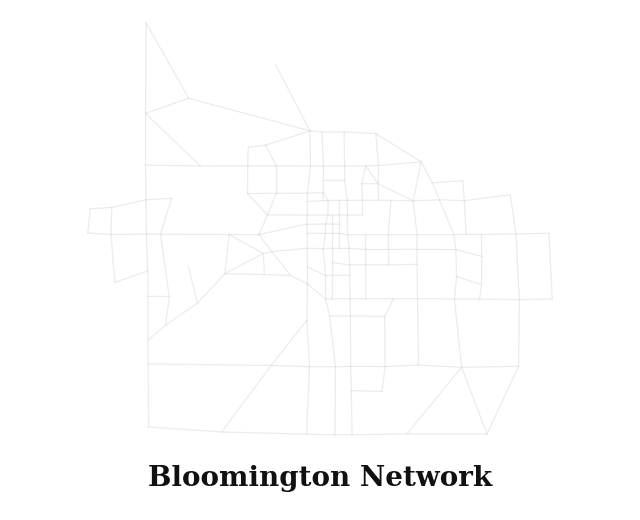
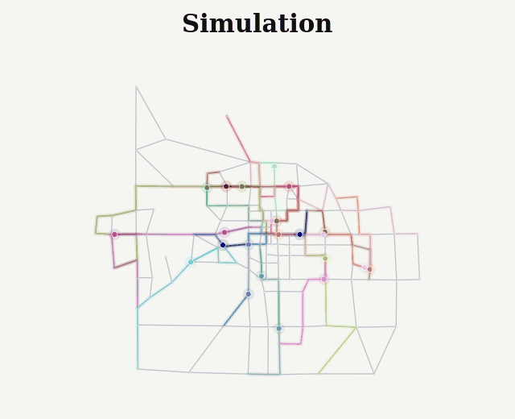

# AlphaTransit: Learning to Design City-scale Transit Routes

This repository implements AlphaTransit, a search-guided reinforcement learning framework for the **Transit Route Network Design Problem (TRNDP)**.

<p align="center">
  
  
</p>

## Problem Overview

TRNDP involves designing a set of transit routes within a road network to optimize passenger service while respecting operational constraints. The problem is NP-hard with a combinatorial search space of approximately 10^82 candidate route sets under the transit-center initialization used in the paper, and approximately 10^116 under unconstrained random initialization.

**Key challenges:**
- Deceptive optimization landscape where greedy choices create bottlenecks
- Sparse, delayed rewards (quality only visible after full simulation)
- Multi-objective trade-offs between passenger experience and operator costs

## Algorithms

### AlphaTransit

AlphaTransit couples Monte Carlo Tree Search (MCTS) with a neural policy-value network:
- **PUCT selection** for balancing exploration and exploitation
- **GATv2 policy-value network** providing action priors and value estimates
- **Dirichlet noise** at root for exploration during MCTS-guided data generation
- **Terminal simulator rewards** with online value-target normalization for stability
- **Parallel episode workers** with configurable worker count; paper experiments use 8 or 16 workers

### End-to-End Reinforcement Learning (PPO with GAE)

Graph-attention actor-critic trained with Proximal Policy Optimization:
- **Parallel environment workers** for efficient sample collection
- **Intermediate delta reward shaping** during route construction + terminal simulation reward
- **Episode-level Generalized Advantage Estimation** for variance reduction
- Same network architecture as AlphaTransit for fair comparison

### Baselines

| Baseline | Description |
|----------|-------------|
| **Random Walk** | Uniform random neighbor selection |
| **Demand Cover** | Sample proportional to demand interaction with the partial route |
| **Shortest Path** | Sample proportional to inverse edge length |
| **Genetic Algorithm** | Population-based metaheuristic with route-exchange crossover and path-regeneration mutation |
| **Bee Colony** | Nikolic and Teodorovic (2013) bee colony optimization with heuristic mutations |
| **Neural Evolutionary** | Holliday et al. (2024, 2025) bee colony optimization with self-trained GNN-guided mutations |
| **Pure MCTS** | MCTS ablation with uniform priors and simulator rollouts |
| **Real World** | Existing Bloomington Transit routes (16 routes) |

Completed route designs are evaluated through the same UXsim reporting pipeline, with frequencies assigned by the same max-load rule. The Bee Colony and Neural Evolutionary baselines use a separate conda environment (`holliday`, Python 3.9) to generate routes, which are then evaluated in AlphaTransit's simulator. See `baselines/neural_evolutionary/README.md` for details.

## Installation

This release is intended to be run from a source checkout. The package metadata
contains console-script and data-file support for smoke testing, but the research
workflow still assumes the repository layout for plots, artifacts, and baseline
reproduction.

### Requirements

- **Python 3.14+** (required for free-threading multiprocessing improvements)
- **CUDA-capable GPU** (optional, for faster training)
- **uv** package manager (recommended)

```bash
# Install uv
curl -LsSf https://astral.sh/uv/install.sh | sh
source $HOME/.local/bin/env

# Clone and setup
git clone <repository-url>
cd Transit_Design  # or the directory created by your clone command
uv sync
source .venv/bin/activate
```

## Quick Start

### Train with best hyperparameters

Pass `--apply_best_params` to use the sweep settings in `config.py`. Explicit CLI args still override; add `--n_iter=500` to match the paper's final AlphaTransit and Pure MCTS search budget.

```bash
# End-to-End Reinforcement Learning (PPO with GAE), alpha=0.3
python main.py --algorithm ppo --gpu --alpha=0.3 --apply_best_params --gamma=0.999 --wandb_off

# End-to-End Reinforcement Learning (PPO with GAE), alpha=1.0
python main.py --algorithm ppo --gpu --alpha=1.0 --apply_best_params --gamma=0.999 --wandb_off

# AlphaTransit with best params (alpha=0.3, roughly 24-27 hours at n_iter=500)
python main.py --algorithm alphatransit --gpu --alpha=0.3 --apply_best_params --n_iter=500 --wandb_off

# AlphaTransit with best params (alpha=1.0, roughly 24-27 hours at n_iter=500)
python main.py --algorithm alphatransit --gpu --alpha=1.0 --apply_best_params --n_iter=500 --wandb_off

# Override a specific param while keeping the rest
python main.py --algorithm ppo --gpu --alpha=0.3 --apply_best_params --lr=0.001 --wandb_off
```

### Run baselines

```bash
# Heuristic baselines (alpha=0.3)
python main.py --mode=baseline --baseline_type=random_walk    --route_init=transit_center --alpha=0.3
python main.py --mode=baseline --baseline_type=demand_cover   --route_init=transit_center --alpha=0.3
python main.py --mode=baseline --baseline_type=shortest_path  --route_init=transit_center --alpha=0.3
python main.py --mode=baseline --baseline_type=real_world     --route_init=transit_center --alpha=0.3

# Heuristic baselines (alpha=1.0)
python main.py --mode=baseline --baseline_type=random_walk    --route_init=transit_center --alpha=1.0
python main.py --mode=baseline --baseline_type=demand_cover   --route_init=transit_center --alpha=1.0
python main.py --mode=baseline --baseline_type=shortest_path  --route_init=transit_center --alpha=1.0
python main.py --mode=baseline --baseline_type=real_world     --route_init=transit_center --alpha=1.0

# Genetic Algorithm
python main.py --mode=baseline --baseline_type=genetic --alpha=0.3 --ga_population=50 --ga_generations=100 --ga_num_workers=4
python main.py --mode=baseline --baseline_type=genetic --alpha=1.0 --ga_population=50 --ga_generations=100 --ga_num_workers=4

# Pure MCTS ablation (paper final comparisons use n_iter=500; this is expensive)
python main.py --mode=baseline --baseline_type=mcts --route_init=transit_center --alpha=0.3 --n_iter=500
python main.py --mode=baseline --baseline_type=mcts --route_init=transit_center --alpha=1.0 --n_iter=500
```

The Holliday EA/NEA baselines use the `evolutionary` and `neural_evolutionary`
baseline types and require the separate environment documented in
`baselines/neural_evolutionary/README.md`.

### Evaluate a saved policy

Evaluation requires a policy generated by a previous training run or provided as
a separate release artifact.

```bash
# AlphaTransit evaluation
python main.py --algorithm alphatransit --mode=eval --saved_policy_path=training_data/<timestamp>/mcts_policies/policy_final.pth

# End-to-End Reinforcement Learning evaluation; checkpoints are written when training with --save_policy_ppo
python main.py --algorithm ppo --mode=eval --saved_policy_path=training_data/<timestamp>/ppo_policies/policy_up_<update>_step_<steps>.pth
```

### Hyperparameter sweeps and ablations

```bash
python sweep.py --algorithm ppo --alpha=0.3 --wandb --count=1
python sweep.py --algorithm alphatransit --alpha=1.0 --wandb --count=1
```

Reward ablations use `--ppo_reward_mode`; available modes are defined in `config.py`.

### Regenerate README GIFs

```bash
python plots/final_viz.py --target all --alpha 0_3
```

## Paper Settings

Paper hyperparameters are summarized in Table 2; repo sweep defaults live in
`config.py` and are applied with `--apply_best_params`.

| Component | Paper setting |
|-----------|---------------|
| Simulation | `T=10000`, `dt=1s`, platoon size `dn=5`, bus capacity 40, 60s dwell time |
| Design task | Bloomington, `K=16` routes, `Lmax=14`, transit-center starts, `alpha in {0.3, 1.0}` |
| AlphaTransit | GATv2 policy-value network, PUCT MCTS, `n_iter=500` for final comparisons |
| End-to-End Reinforcement Learning (PPO with GAE) | 1M environment steps, delta-coverage shaping without early-stop penalty |
| Genetic Algorithm | Population 50, 100 generations, route-exchange crossover, path-regeneration mutation |

## Project Structure

```
AlphaTransit/
├── main.py                 # CLI entry point
├── config.py               # Configuration, argument parsing, and best hyperparameters
├── alpha.py                # AlphaTransit training/evaluation
├── ppo.py                  # PPO training/evaluation
├── sweep.py                # WandB hyperparameter sweeps
│
├── rl/
│   ├── env.py              # TransitEnv (Gymnasium wrapper for UXsim)
│   ├── models.py           # GATv2ActorCritic network architecture
│   ├── mcts_agent.py       # AlphaTransit agent implementation
│   ├── mcts_utils.py       # MCTS tree, replay buffer, Welford normalizer
│   ├── mcts_worker.py      # Parallel episode collection for AlphaTransit
│   ├── ppo_agent.py        # PPO agent implementation
│   ├── ppo_utils.py        # PPO memory buffer, normalizers
│   ├── parallel_env.py     # Parallel environment workers for PPO
│   └── env_utils.py        # Plotting, aggregation, seed utilities
│
├── baselines/
│   ├── heuristics.py       # Heuristic baselines (RandomWalk, DemandCoverage, etc.)
│   ├── genetic.py          # Genetic Algorithm baseline
│   ├── mcts.py             # Pure MCTS baseline (ablation, no learned network)
│   ├── neural_evolutionary/# Holliday et al. EA/NEA baseline
│   └── utils.py            # Shared baseline utilities
│
├── networks/
│   ├── bloomington/        # Bloomington, IN network data
│   │   ├── bloomington_nodes_standard.csv
│   │   ├── bloomington_links_standard.csv
│   │   ├── bloomington_demand_standard.csv
│   │   └── bloomington_existing_routes.json
│   ├── laval/              # Laval, QC transfer network from Holliday et al.
│   └── sioux_falls/        # Sioux Falls network (for testing)
│
├── uxsim/                  # UXsim v1.8.2 with custom bus-transit extensions
├── plots/                  # Visualization and analysis scripts
└── training_data/          # Training outputs, checkpoints, sweep data
```

## Simulation

- **Engine**: Built on [UXsim](https://github.com/toruseo/UXsim) v1.8.2 (released June 17, 2024), a mesoscopic traffic simulator using Newell's car-following model. We add custom extensions for bus transit simulation (bus dispatching, passenger boarding/alighting, transfers) and standardized evaluation tooling. The modified source is included in the `uxsim/` directory.
- **Time step**: dt = 1 second, platoon size dn = 5
- **Horizon**: 10,000 steps (~2.7 hours)
- **Bus parameters**: 40 passenger capacity, 60s dwell time per stop
- **Frequency setting**: Max-load rule normalized for route overlaps

## Data

The Bloomington network includes:
- **143 nodes, 243 bidirectional edges** (topologically accurate road network)
- **Origin-destination demand** derived from LEHD/LODES census data
- **16 existing bus routes** from Bloomington Transit GTFS feed

## Logging

Weights & Biases logging is opt-in. Local runs are offline by default unless
`--wandb` is passed.

```bash
# With WandB
python main.py --algorithm alphatransit --wandb --wandb_project=transit --wandb_entity=<entity>

# Without WandB
python main.py --algorithm alphatransit --wandb_off
```
