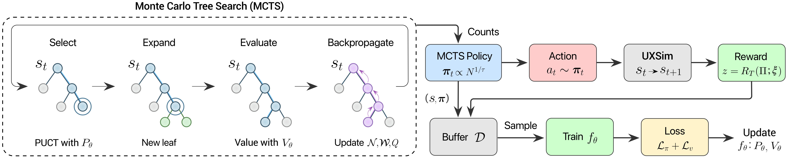

## AlphaTransit: Learning to Design City-scale Transit Routes

<p>
  <a href="https://alphatransit.app/"></a>
  <a href="https://arxiv.org/pdf/2605.28730"></a>
  <a href="https://huggingface.co/papers/2605.28730"></a>
  <a href="https://github.com/poudel-bibek/AlphaTransit/releases"></a>
</p>

<p align="center">
  
</p>

---
### 📌 Overview

AlphaTransit is a reinforcement learning framework for the **Transit Route Network Design Problem (TRNDP)**. It designs city-scale bus networks by combining learned guidance with tree search. As routes are built one stop at a time, the policy narrows the search space and prioritizes promising routes across the full network. Completed designs are evaluated through simulation, linking route choices to network-level performance.

<p align="center">
  
  <br>
  <em>
  A graph neural policy-value network guides MCTS during route construction, while UXsim evaluates completed networks and returns simulation feedback for training.
  </em>
</p>

---
### 📊 Data

Runtime inputs are standardized CSV/JSON files under `networks/`. Bloomington is the primary city-scale case study.

<p align="center">
  
</p>

| Input | Location | Description |
| --- | --- | --- |
| Bloomington network | `networks/bloomington/bloomington_nodes_standard.csv`, `networks/bloomington/bloomington_links_standard.csv` | 143 nodes and 243 bidirectional road links for Bloomington, Indiana. |
| Bloomington demand | `networks/bloomington/bloomington_demand_standard.csv` | 5,737 OD demand rows derived from LEHD/LODES commuting data. |
| Bloomington real routes | `networks/bloomington/bloomington_existing_routes.json` | 16 existing Bloomington Transit routes used as the existing service baseline. |

Raw Bloomington node and link files are tracked. The raw LEHD/LODES CSV and Census block shapefile used to rebuild Bloomington demand are not included in the repository. The rebuild workflow is in `networks/data_standardization.py`; diagnostic maps are implemented in `plots/network_diagnostics.py` and require the optional geospatial dependencies.

---
### 📦 Outputs

Training, baseline, and evaluation runs create local output folders under `--save_dir`. Depending on the command and save options, those folders contain run configuration, policy checkpoints, evaluation summaries, and designed routes.

Saved policies can be evaluated with `main.py`, and saved result summaries can be used by the plotting utilities.

---
### 🤗 Hugging Face

| Artifact | Link | Contents |
| --- | --- | --- |
| Paper page | [HF Papers](https://huggingface.co/papers/2605.28730) | Paper metadata and project links on Hugging Face Papers. |
| Model checkpoints | [AlphaTransit checkpoints](https://huggingface.co/Bibek-Poudel/alphatransit-checkpoints) | AlphaTransit policy checkpoints for Bloomington at `alpha=0.3` and `alpha=1.0`, plus model configuration and a checkpoint manifest. |
| Bloomington dataset | [Bloomington TRNDP](https://huggingface.co/datasets/Bibek-Poudel/bloomington-trndp) | Standardized Bloomington nodes, links, OD demand, and existing routes. Raw LEHD/LODES and Census inputs are not included. |

---
### ⚙️ Setup

Use the source checkout to reproduce paper figures, standardize networks, and rerun experiments. Package installs include runtime packages, top-level training entry points, and selected standardized Bloomington/Sioux Falls data files. AlphaTransit builds on UXsim v1.8.2 (June 17, 2024), with custom bus transit extensions under `uxsim/`.

- Install Python 3.14+.
- Install [uv](https://docs.astral.sh/uv/).
- CUDA is optional but strongly recommended for training.

```bash
# Install uv
curl -LsSf https://astral.sh/uv/install.sh | sh
source $HOME/.local/bin/env

# Clone and sync the project environment
git clone https://github.com/poudel-bibek/AlphaTransit.git
cd AlphaTransit
uv sync

# Optional: geospatial/network diagnostic plotting dependencies
uv sync --extra advanced

# Optional: Holliday EA/NEA regeneration dependencies
uv sync --extra baseline-repro
```

---
### 🚀 Training

The main entry point is `main.py`. Pass `--apply_best_params` to use the sweep settings in `config.py`; explicit CLI arguments still override those values. Use `--n_iter=500` for full AlphaTransit and Pure MCTS comparisons; lower values are useful for faster test runs.

```bash
# PPO with GAE
uv run python main.py --algorithm ppo --gpu --alpha=0.3 --apply_best_params --gamma=0.999

# AlphaTransit
uv run python main.py --algorithm alphatransit --gpu --alpha=0.3 --apply_best_params --n_iter=500
```

Use `--alpha=1.0` for the high transit demand setting. Weights & Biases logging is disabled by default; pass `--wandb` to enable it. Main training runs and released-checkpoint logs are summarized in the [WandB report](https://wandb.ai/bibek-poudel/transit_design/reports/ALPHATRANSIT_REPORT_PLACEHOLDER).

---
### 🧪 Baselines

AlphaTransit is compared against heuristic baselines, evolutionary methods, Pure MCTS, PPO, and the existing Bloomington Transit routes.

```bash
# Heuristic baselines: random_walk, demand_cover, shortest_path, real_world
uv run python main.py --mode=baseline --baseline_type=random_walk --route_init=transit_center --alpha=0.3

# Genetic Algorithm
uv run python main.py --mode=baseline --baseline_type=genetic --alpha=0.3 --ga_population=50 --ga_generations=100 --ga_num_workers=4

# Pure MCTS ablation
uv run python main.py --mode=baseline --baseline_type=mcts --route_init=transit_center --alpha=0.3 --n_iter=500
```

Change `--baseline_type` and `--alpha` to run the remaining baseline/alpha combinations.

The Holliday EA/NEA baselines use the `evolutionary` and `neural_evolutionary` baseline types. Evaluating supplied route artifacts runs in AlphaTransit's main environment; regenerating routes or training the GNN requires the separate Python 3.9 `holliday` environment documented in `baselines/neural_evolutionary/README.md`.

---
### 📈 Evaluation

Evaluation of learned policies requires a saved policy from training or the checkpoint release.

```bash
uv run python main.py --algorithm alphatransit --mode=eval --saved_policy_path=path/to/policy_final.pth
```

For PPO checkpoints, use `--algorithm ppo` and point `--saved_policy_path` to the saved PPO policy. Evaluation writes aggregate summaries and designed routes under the configured output directory.

---
### 🖼️ Figures and Analysis

The canonical plotting entry point is `plots/main.py`.

```bash
# List available plot and analysis commands
uv run python -m plots.main --help
```

Plot commands write to paths you choose. Some plots can be rebuilt from the tracked standardized data; result comparison plots require result summaries generated by evaluation or supplied separately.

Network standardization diagnostic plots live in `plots/network_diagnostics.py` and are used by `networks/data_standardization.py`. Those diagnostics require the optional geospatial dependencies installed by `uv sync --extra advanced`.

---
### 📝 Code Structure

```text
├── main.py                  # Training, evaluation, and baseline entry point
├── config.py                # Runtime configuration, CLI arguments, best hyperparameters
├── alpha.py                 # AlphaTransit train/eval dispatch
├── ppo.py                   # PPO train/eval dispatch
├── sweep.py                 # WandB hyperparameter sweep launcher
├── pyproject.toml           # uv project metadata and dependencies
├── uv.lock                  # Locked dependency resolution
├── rl/
│   ├── env.py               # TransitEnv Gymnasium wrapper around UXsim
│   ├── models.py            # GATv2 actor critic / policy and value network
│   ├── mcts_agent.py        # AlphaTransit MCTS + neural guidance implementation
│   ├── mcts_worker.py       # Parallel AlphaTransit episode workers
│   ├── ppo_agent.py         # PPO agent implementation
│   ├── parallel_env.py      # Parallel PPO environment workers
│   └── env_utils.py         # Evaluation, plotting, aggregation, and seed utilities
├── baselines/
│   ├── heuristics.py        # Random Walk, Demand Cover, Shortest Path, Real World
│   ├── genetic.py           # Genetic Algorithm baseline
│   ├── mcts.py              # Pure MCTS ablation
│   └── neural_evolutionary/ # Holliday et al. EA/NEA baseline bridge
├── networks/
│   ├── data_standardization.py # Raw data conversion workflow
│   ├── bloomington/         # Bloomington standardized data and real routes
│   ├── sioux_falls/         # Sioux Falls benchmark data
│   └── laval/               # Laval benchmark data
├── plots/
│   ├── common.py            # Shared plot paths, styles, and utility loaders
│   ├── main.py              # Unified plotting CLI
│   ├── routes.py            # Route figures, GIFs, and structural route analysis
│   ├── networks.py          # Paper network figures
│   ├── network_diagnostics.py # Diagnostic plots used during data standardization
│   ├── training.py          # Training, ablation, scaling, and Pareto figures
│   ├── final_plots.py       # Final paper comparison and overview figures
│   └── final_viz.py         # Supplementary visual rendering utilities
└── uxsim/                   # UXsim v1.8.2 with custom bus transit extensions
```

---
### 🔧 Configuration Values

| Key | Default | Notes |
| --- | ---: | --- |
| `algorithm` | `None` | Required for training/evaluation; choices are `ppo` and `alphatransit`. |
| `mode` | `train` | Choices are `train`, `eval`, and `baseline`. |
| `network` | `bloomington` | Runtime network; choices are `bloomington` and `sioux_falls`. |
| `alpha` | `0.3` | Modal split parameter; `1.0` is the high transit demand setting. |
| `horizon` | `10000` | Simulation horizon in seconds. |
| `delta_t` / `delta_n` | `1` / `5` | UXsim time step and platoon size. |
| `bus_capacity` | `40` | Passenger capacity per bus. |
| `stop_duration` | `60` | Dwell time in seconds. |
| `num_routes` | `16` | Number of routes in the Bloomington design task. |
| `max_route_length` | `14` | Maximum nodes per route. |
| `min_route_length` | `2` | Minimum nodes per route. |
| `route_init` | `transit_center` | Route initialization scheme. |
| `max_steps` | `1,000,000` | PPO training environment step budget. |
| `num_ppo_workers` | `8` | Parallel PPO environment workers. |
| `n_iter` | `100` | AlphaTransit MCTS simulations per move; final paper comparisons use `500`. |
| `num_mcts_workers` | `16` | Parallel AlphaTransit episode workers. |
| `episodes_per_iter` | `16` | AlphaTransit episodes collected per training iteration. |
| `max_iterations` | `308` | Default AlphaTransit training iterations. |
| `wandb_off` | `True` | WandB is disabled by default; pass `--wandb` to enable logging. |

---
### Reproduction Notes

- Rebuilding Bloomington demand from raw sources requires the external LEHD/LODES CSV and Census block shapefile referenced by `networks/data_standardization.py`.

---
### 📖 Citation

If you find this work useful in your own research:

```bibtex
@misc{poudel2026alphatransit,
  title = {AlphaTransit: Learning to Design City-scale Transit Routes},
  author = {Poudel, Bibek and Swaminathan, Sai and Li, Weizi},
  year = {2026},
  eprint = {2605.28730},
  archivePrefix = {arXiv},
  url = {https://arxiv.org/abs/2605.28730}
}
```
